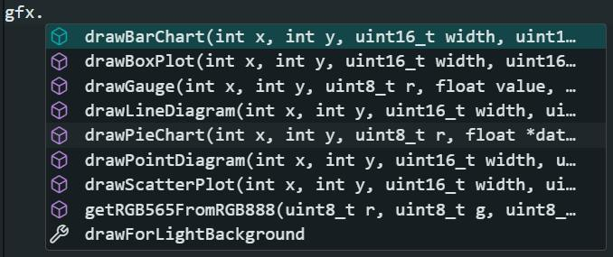

# TFTGraph
A data visualizing library for TFT displays.

## Features:
Allows you to automatically insert a fully drawn graph of your choosing into a TFT screen wired into an Arduino Uno, ESP8266 and ESP32.

Uses the [Adafruit TFTLCD library](https://github.com/adafruit/TFTLCD-Library) to function.

### Currently available graphs:
- Bar chart
- Box plot
- Gauge chart
- Line diagram
- Pie chart
- Point diagram
- Scatter plot

An `RGB888 (24-bit)` to `RGB565 (16-bit unsigned integer)` colour converter is also available.

## How to use:
First, initialize the Adafruit TFTLCD Library as an object and pass it into the initialization of TFTGraph:
```c
Adafruit_TFTLCD tft;
TFTGraph gfx(tft);
```
The names here are arbitrary, but for this example; `Adafruit TFTLCD` is `tft` and `TFTGraph` is `gfx`.

### Creating graphs/diagrams:
By simply typing "`gfx.`" a list of all drawable graphs appear, as well as a `RGB888` to `RGB565` converter and a global boolean called `drawForLightBackground`.



When you click one of these options, the function call for that diagram appears, here is for example the function call for `drawScatterPlot`:
```c
gfx.drawScatterPlot(int x, int y, uint16_t width, uint16_t height, float (*data)[3], int start, int end, uint16_t *colors, bool drawBackground)
```
And here you can add in the values with the given datatypes and see a diagram appear on the TFT screen! All of the graphs use floats in an array to display a dataset, the scatter-plot is unique in that it requires a 2-dimensional array with more information. It is recommended to look at the examples provided in the library to see the use-cases and how to utilize the library.

Important to note that graphs can be combined as shown in the examples `LineAndPointDiagramCombination` and `StackedAreaGraph`. This is easy to do as you can disable background drawing when drawing a graph, making overlapping graphs possible.

Also notice the `getRGB565FromRGB888()` function. Pass in the traditional 8-bit RGB values into the functions to get the unsigned 16-bit integer color value required in all of the graphs.

If you want to utilize a light background (like pure white) for the diagrams to be drawn in front of, you can set the boolean `drawForLightBackground` to `true`. This can be done like this:
```c++
gfx.drawForLightBackground = true;
```
This sets the primary colors of borders and text to black instead of white, making them contrast with the background.

## Contact/Help:
If you want to suggest a new graph or diagram to add to this library, please do [send an email](mailto:nick.awsome74@gmail.com)! This project is also open-source, so feel free to add one yourself using the already established modular function setup. :)

This library was built as a part of a bachelor project for IT and management spring 2026 in the [University of South-Eastern Norway](https://www.usn.no/). The idea is attributed to our professor Lasse Berntzen.